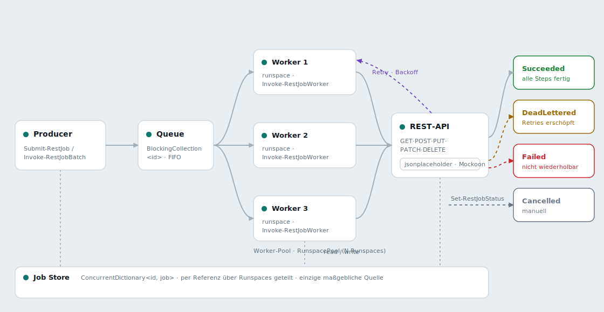
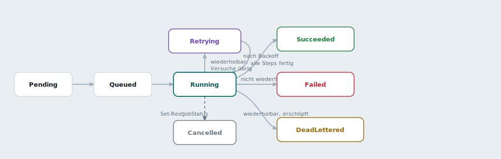
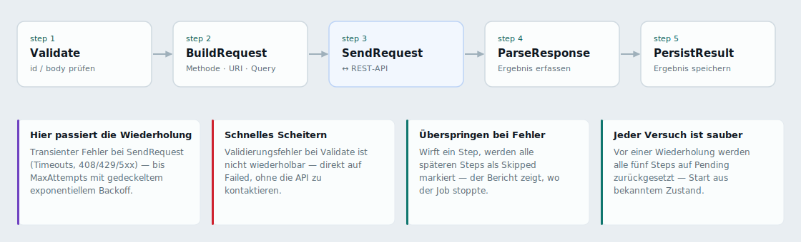
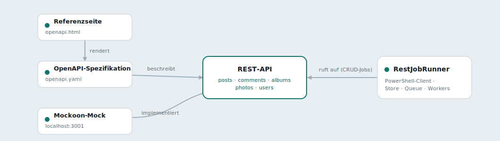

<div align="center">

# Powershell REST JobRunner Suite

### Eine asynchrone REST-CRUD-Job-Engine — **vollständig in PowerShell 7+ geschrieben**

[](https://learn.microsoft.com/powershell/)
[](https://pester.dev/)


-CC2927?logo=microsoftsqlserver&logoColor=white)


**Die Kern-Engine ist zu 100 % PowerShell** — idiomatische Runspace-Pool-Parallelität über native
.NET-Concurrency-Primitive, kein dünner Wrapper um eine andere Laufzeitumgebung.

</div>

---

> ## 🟦 In PowerShell gebaut
>
> Dies ist in erster Linie ein **PowerShell-Engineering-Projekt**. Die Job-Engine — der Store, die
> Queue, der Worker-Pool, die Wiederholungslogik, das strukturierte Audit-Logging — ist in
> **idiomatischem PowerShell 7.2+** geschrieben und wird von einer **Pester-5**-Testsuite getrieben.
> Das C#-Dashboard, das T-SQL-Schema und die Python-Generatoren existieren nur, um der PowerShell-Engine
> zu *dienen*, nicht umgekehrt.

```powershell
PS C:\RestJobRunner> Import-Module ./RestJobRunner.psd1 -Force
PS C:\RestJobRunner> Invoke-RestJobBatch -Jobs $jobs -WorkerCount 4 -ModulePath ./RestJobRunner.psd1

# 4 Runspaces leeren eine gemeinsame BlockingCollection — eine ID pro Worker
[INFO ] Run start: 4 job(s) across 4 worker(s).
[INFO ] [w1] Start 'List users'  [List users]    GET  200  41ms
[INFO ] [w2] Start 'Read post 1' [Read posts]    GET  200  54ms
[INFO ] [w3] Start 'New post'    [Create posts]  POST 201  88ms
[WARN ] [w4] step 'SendRequest' failed (retryable). Backing off 2s.
[ERROR] [w4] DeadLettered after 3 attempt(s): Connection refused
[INFO ] Run complete: DeadLettered=1, Succeeded=3
```

### Sprachverteilung

| Sprache | Anteil | Rolle |
|---|---|---|
| 🟦 **PowerShell** | **~72 %** | **Die Engine** — Modul, Jobs, Queue, Workers, Retry, Logging, Tests |
| 🟪 C# | ~14 % | Schreibgeschütztes ASP.NET-Core-Audit-Dashboard |
| 🟧 T-SQL | ~7 % | Append-only-Audit-Tabelle, manipulationssichere Trigger, Least-Privilege-Rolle |
| 🟦 Python | ~5 % | OpenAPI-/Mockoon-Vertragsgeneratoren |
| ⬜ Sonstiges | ~2 % | OpenAPI-YAML, HTML-Diagramme |

---

## Was die Suite enthält

Eine REST-API (JSONPlaceholders `posts` / `comments` / `albums` / `photos` / `users`) ist der
Dreh- und Angelpunkt. Die **PowerShell-Engine** steuert sie an; alles Übrige beschreibt, mockt,
auditiert oder visualisiert diesen Ablauf.

| Komponente | Stack | Was es ist |
|---|---|---|
| **`RestJobRunner/`** | **PowerShell 7.2+** | **Die Engine.** Asynchroner CRUD-Job-Runner: Store + Queue + Runspace-Pool, 5-stufige Pipeline, zwei Retry-Ebenen, strukturiertes Multi-Sink-Audit-Logging. |
| `RestJobAuditDashboard/` | C# · .NET 8 | Schreibgeschützte ASP.NET-Core-Konsole über der Audit-Tabelle: Live-Suche, automatische Aktualisierung, Level-/Kategorie-Filter, Hell/Dunkel. |
| `api-contract/` | OpenAPI · Mockoon | OpenAPI-3.0.3-Spezifikation, eine eigenständige HTML-Referenz und ein lauffähiger Mockoon-Mock der API. |
| `diagrams/` | SVG · Mermaid · HTML | Ressourcen-ER-Diagramm, die vier System-Diagramme unten + eine animierte Laufzeit-/Datenfluss-Übersicht. |
| `design/` | HTML | Das Konsolen-Theme des Dashboards als lebender Token-/Komponenten-Styleguide. |
| `tools/` | Python | Regenerieren die OpenAPI-Spezifikation und die Mockoon-Umgebung aus der Quelle. |

> 📄 **`index.html`** in diesem Ordner ist eine eigenständige **Portfolio-Seite** in einer einzigen
> Datei, die alles Folgende visuell präsentiert (dunkel als Standard, mit Hell-Umschalter). Direkt im
> Browser öffnen oder über GitHub Pages ausliefern. Sie nutzt exakt dieselben Design-Tokens wie das
> Live-Dashboard.

---

## Wie es funktioniert

Ein **Producer** übergibt CRUD-Jobs an einen gemeinsamen Store und eine Queue; ein Pool von
**Runspace-Workern** leert die Queue parallel und führt jeden Job durch eine fünfstufige
**Anfrage-Pipeline** gegen die REST-API — mit Wiederholung und strukturierten Ergebnissen. Die vier
Diagramme unten sind aus der **animierten** Übersicht
[`diagrams/system-overview.html`](diagrams/system-overview.html) exportiert — diese im Browser öffnen
für bewegte Jobs und Hover-Details.

### 01 · Laufzeit-Datenfluss

> *Jobs, die nebenläufig durch die Engine wandern.*



*● ein Job (CRUD-Anfrage)  ·  ── Datenfluss  ·  ┈ Retry- / Ausnahmepfad*

**Die Invariante, die das Ganze sicher macht:** Durch die Queue wandern nur Job-*IDs*, und jede ID wird
von genau einem Worker übernommen — obwohl also viele Jobs gleichzeitig laufen, wird kein einzelner
Job-Datensatz je von zwei Threads geschrieben. Jede Statusänderung läuft durch einen einzigen Engpass
(`Set-RestJobState`), der zugleich den gemeinsamen Store aktualisiert.

### 02 · Job-Lebenszyklus

> *Die Zustände, die ein einzelner Job durchläuft.*



**Endzustände** sind `Succeeded`, `Failed`, `DeadLettered` und `Cancelled`. Der Unterschied zwischen
`Failed` und `DeadLettered` ist die Fehlerart: Ein nicht wiederholbarer Fehler (etwa Validierung)
scheitert sofort, während ein wiederholbarer Fehler, dem die Versuche ausgehen, ins Dead-Letter wandert.

### 03 · Anfrage-Pipeline

> *Die fünf Steps, die jeder Job pro Versuch durchläuft.*



| Step | Tut |
|---|---|
| **Validate** | Prüft Vorhandensein von `TargetId` / `Body` je Operation |
| **BuildRequest** | Methode · URI · Body-Aufbau, Query-String-Kodierung |
| **SendRequest** | `Invoke-RestMethod` mit Stoppuhr-Zeitmessung |
| **ParseResponse** | Deserialisieren, Ergebnis normalisieren |
| **PersistResult** | In den Store schreiben; optionaler Disk-Snapshot |

- **Hier passiert die Wiederholung.** Ein transienter Fehler bei `SendRequest` (Timeouts, 408/429/5xx)
  wird bis zu `MaxAttempts` mit gedeckeltem exponentiellem Backoff wiederholt.
- **Schnelles Scheitern.** Ein Validierungsfehler bei `Validate` ist nicht wiederholbar — der Job geht
  direkt auf `Failed`, ohne die API überhaupt zu kontaktieren.
- **Überspringen bei Fehler.** Wirft ein Step eine Ausnahme, werden alle späteren Steps als `Skipped`
  markiert, sodass der Bericht genau zeigt, wo der Job gestoppt ist.
- **Jeder Versuch startet sauber.** Vor einer Wiederholung werden alle fünf Steps auf `Pending`
  zurückgesetzt, sodass ein Versuch immer in einem bekannten Zustand beginnt.

`Get-RestJobReport` verdichtet das zu Done- / Pending- / Failed-Zählern pro Job.

### 04 · Wie alles zusammenpasst

> *Die Artefakte rund um eine einzige API.*



**Ein Vertrag, drei Begleiter:** Die **Spezifikation** dokumentiert die API, die **Referenzseite**
rendert diese Spezifikation, der **Mockoon-Mock** implementiert sie als lauffähigen Server, und
**RestJobRunner** ist ein Client, der sie mit nebenläufigen CRUD-Jobs ansteuert.

---

## Wichtige Design-Entscheidungen

Hier stecken die interessanten, **eindeutig PowerShell-spezifischen** Entscheidungen.

### 1. `PSCustomObject`-Datensätze statt PowerShell-`[class]`
Die Typidentität einer PowerShell-`class` gilt **pro Runspace** — wird eine Klasseninstanz über eine
`RunspacePool`-Grenze gereicht, verkommt sie stillschweigend zu einem undurchsichtigen `PSObject` ohne
zugängliche Member. `PSCustomObject`s und *String*-Statuswerte überqueren Runspace-Grenzen sauber, weil
Member über den Namen aufgelöst werden, nicht über die Typidentität. Die `enum`s in `Enums.ps1` bleiben
die einzige maßgebliche Quelle und werden in `ValidateSet` auf öffentlichen Parametern gespiegelt.

### 2. `BlockingCollection` + `GetConsumingEnumerable()` — kanonisches Producer/Consumer
Jede Job-ID wird von genau einem Worker verbraucht (keine Duplikate, kein Polling).
`GetConsumingEnumerable()` blockiert bei leerer Queue und endet sauber, nachdem `CompleteAdding()`
geleert wurde — Worker beenden sich von selbst, keine Sentinel-Werte, kein Busy-Wait. Der Store hält den
veränderlichen Datensatz; durch die Queue reist nur die ID.

### 3. Zwei unabhängige Retry-Ebenen
**Auf Job-Ebene** (bis zu `MaxAttempts`, Standard 3) wird die gesamte Pipeline mit gedeckeltem
exponentiellem Backoff erneut ausgeführt (`RetryBackoffSeconds × 2ⁿ⁻¹`, gedeckelt bei
`RetryBackoffCapSeconds`). **Auf Anfrageebene** (`Config.HttpMaxRetries`) ist standardmäßig deaktiviert,
damit sich die beiden Ebenen nie stillschweigend multiplizieren. `Test-RetryableError` entscheidet:
Transportfehler und HTTP 408/429/5xx werden wiederholt; Validierung und andere 4xx nicht.

### 4. Keine stille Verlustgarantie
Wirft ein Sink mitten im Lauf (DB nicht erreichbar, Platte voll), werden der Datensatz **und** der Fehler
an eine Fallback-JSONL-Datei angehängt und eine Warnung ausgegeben — das Audit-Ereignis geht nie verloren
und reißt nie einen Worker mit. Der File-Sink serialisiert über einen benannten OS-Mutex; der SQL-Sink
nutzt pro Schreibvorgang eine gepoolte Verbindung.

### 5. Append-only-Audit-Tabelle mit manipulationssicheren Triggern
Der SQL-Sink führt ausschließlich `INSERT`s aus. Die Manipulationssicherheit ist mehrschichtig: kein
UPDATE/DELETE aus der Engine; optionale `INSTEAD OF UPDATE, DELETE`-Trigger weisen In-Place-Änderungen in
der Datenbank ab; eine Spalte `RowInsertedUtc DEFAULT SYSUTCDATETIME()` erfasst die echte Einfügezeit
unabhängig von der Anwendung; die Schreibrolle erhält nur `INSERT` / `SELECT`. Eine
**Ledger-Tabellen**-Variante für SQL Server 2022 liefert kryptografische Manipulationsnachweise.

### 6. Explizite öffentliche Oberfläche
Jeder Helfer ist privat und wird über `InModuleScope` getestet; öffentlich sind nur die Funktionen aus
`FunctionsToExport` im Manifest. `Set-StrictMode -Version Latest` und `$ErrorActionPreference = 'Stop'`
auf Modulebene; genehmigte Verben + ein einheitlicher `RestJob`-Substantiv-Namensraum vermeiden
Kollisionen mit Built-ins wie `Get-Job` / `Start-Job`.

---

## Strukturiertes Logging & Audit-Trail

Jede Aktion, jedes Ergebnis, jede Wiederholung und jeder Fehler läuft durch einen einzigen Einstiegspunkt
(`Write-RestJobLog`), der einen **strukturierten Datensatz mit 27 Spalten** baut und an die vom Admin
gewählten Sinks verteilt.

| `LogTarget` | Schreibt nach |
|---|---|
| `File` | Logdatei — Text oder JSON Lines (Standard) |
| `Database` | die Append-only-SQL-Server-Tabelle |
| `Both` | Datei **und** Datenbank |
| `None` | nur Konsole, falls aktiviert |

`Config.LogToConsole` ist unabhängig von `LogTarget`. Der Datensatz trägt genug, um exakt zu
rekonstruieren, was in welcher Reihenfolge über alle Worker hinweg passiert ist: UTC-Ereigniszeit, Level,
Kategorie, Run-/Job-Korrelations-IDs, Ressource/Operation, Versuch, Step, Status,
HTTP-Methode/-URL/-Status/-Dauer, Fehlertyp & -detail sowie Host/Benutzer/Prozess/Runspace des Erzeugers.

---

## Das Audit-Dashboard

`RestJobAuditDashboard/` ist eine kleine **ASP.NET-Core-Minimal-API (.NET 8)** plus ein
Single-Page-Client, der die Append-only-Tabelle `RestJobAuditLog` in eine **Live-Betriebskonsole**
verwandelt — derselbe Audit-Trail, den die PowerShell-Engine schreibt, in Echtzeit und neueste zuerst.

```
┌ ● LIVE  RestJobRunner · Audit log               12:04:31   [⏸ Pause] [☾] ┐
├ [ Total 12.481 ] [ Errors 37 ] [ Warnings 204 ] [ Info 11.902 ]   ▁▂▅▇▃   │
├ 🔎 Suche…                Alle Level ▾   Alle Kategorien ▾   200 Zeilen ▾    │
│ ─────────────────────────────────────────────── (Aktualisierungsfortschritt)│
│ 12:04:30  ERROR  Request    make-post Create   POST 500 412ms  POST …/posts│
│ 12:04:29  WARN   Retry      list-users         GET  429  88ms  backing off │
│ 12:04:28  INFO   Lifecycle  read-post-1        —              -> Succeeded │
└────────────────────────────────────────────────────────────────────────────┘
```

### HTTP-API

Drei schreibgeschützte JSON-Endpunkte versorgen den Client:

| Endpunkt | Query-Parameter | Liefert |
|---|---|---|
| `GET /api/config` | — | `{ refreshSeconds, pageSize }` — Abrufintervall + Seitengröße aus der Konfiguration |
| `GET /api/meta` | — | `{ categories[], levels[] }` — eindeutige Kategorien (aus der Tabelle) + festes Level-Vokabular |
| `GET /api/logs` | `search`, `level`, `category`, `take` (1–1000), `sinceId` | `{ rows[], total, levelCounts, maxId, serverTimeUtc }` |

- **`search`** läuft **serverseitig über 16 Spalten** (Message, Job, Kategorie, Ressource, Operation,
  Status, Run-/Job-ID, Fehlertyp & -detail, URL, Methode, Maschine, Benutzer, App, Statuscode) — man
  durchsucht also die *gesamte Tabelle*, nicht nur die sichtbaren Zeilen.
- **`sinceId`** macht Aktualisierungen **inkrementell**: Der Client sendet die höchste `AuditId`, die er
  hält, und erhält nur neuere Zeilen zurück; `maxId` ist die neue Obergrenze.
- **`levelCounts`** werden über die gesamte gefilterte Menge berechnet (unabhängig vom `sinceId`-Fenster),
  damit die Statistikkarten korrekt bleiben.
- Zeilen kommen neueste zuerst (`ORDER BY AuditId DESC`) und tragen alle **27 Spalten** für die
  Detailansicht.

### Sicher durch Konstruktion

- **Jeder Filterwert ist parametrisiert** (`@s`, `@lvl`, `@cat`, `@take`, `@since`) — keine
  String-Verkettung von Benutzereingaben in SQL.
- Schema-/Tabellennamen aus der Konfiguration werden gegen `^[A-Za-z_][A-Za-z0-9_]{0,127}$` (`SafeIdent`)
  validiert, bevor sie eine Query berühren — so kann nicht einmal die Konfiguration SQL einschleusen.
- **Schreibgeschützt und ohne Authentifizierung by design.** Für den Einsatz außerhalb von „lokal“ dem
  SQL-Login nur `SELECT` auf der Audit-Tabelle gewähren und die App hinter eigene Auth / Reverse-Proxy
  stellen. Sie schreibt nie in die Datenbank.

### Konfigurieren & starten

```bash
cd RestJobAuditDashboard
# ConnectionStrings:AuditDb auf die Datenbank mit der Audit-Tabelle zeigen lassen —
# via appsettings.json oder die Umgebungsvariable ConnectionStrings__AuditDb
dotnet run                      # → http://localhost:5099
```

| `appsettings.json`-Schlüssel | Standard | Zweck |
|---|---|---|
| `ConnectionStrings:AuditDb` | `Server=localhost;Database=Ops;…` | SQL Server mit der Audit-Tabelle |
| `Audit:Schema` / `Audit:Table` | `dbo` / `RestJobAuditLog` | Welche Tabelle gelesen wird |
| `Dashboard:RefreshSeconds` | `5` | Abrufintervall (Sekunden) |
| `Dashboard:PageSize` | `200` | Zeilen pro Abruf (UI bietet auch 100–1000) |

### Client-Funktionen

Live-Suche (entprellt) · Level- + Kategorie-Filter · klickbare Statistikkarten, die den Level-Filter
umschalten · automatische Aktualisierung mit Fortschrittsleiste und **Pause/Fortsetzen** · neue Zeilen
blinken mit einer severity-farbigen Kante · Klick auf eine Zeile zeigt das volle 27-Spalten-Detail ·
**Hell/Dunkel-Umschalter** (dunkel Standard, gespeichert).
Tastatur: `/` fokussiert die Suche, `Esc` leert sie, `Space` pausiert/fortsetzt.

### Demo-Modus — keine Datenbank nötig

`RestJobAuditDashboard/wwwroot/index.html` **direkt als Datei** öffnen (ohne Server). Ist kein
`/api`-Backend erreichbar, fällt der Client auf **generierte Beispieldaten** zurück, die im
Aktualisierungsintervall weiter eintreffen — ein **DEMO-DATA**-Badge stellt klar, dass es nicht echt ist —
sodass Suche, Filter, Live-Updates und der Theme-Umschalter offline erkundbar sind. (Läuft die App,
kann aber die Datenbank nicht erreichen, erscheint stattdessen ein klares Fehler-Banner statt
Fake-Daten.)

---

## Öffentliche API

15 exportierte Funktionen — genehmigte Verben, `RestJob`-Substantiv-Namensraum.

| Funktion | Zweck |
|---|---|
| `New-RestJob` | Baut einen Job-Datensatz für eine CRUD-Operation |
| `Submit-RestJob` | In den Store legen **und** einreihen (→ `Queued`) |
| `Invoke-RestJobBatch` | Komplettlauf: Store + Queue + Pool + Warten + Bericht |
| `Invoke-RestJob` | Führt einen Job bis zu einem Endzustand aus (der deterministische Kern) |
| `Invoke-RestJobWorker` | Verbraucherschleife pro Runspace (auch single-threaded ausführbar) |
| `Start/Wait/Stop-RestJobWorkerPool` | Lebenszyklus des asynchronen Runspace-Worker-Pools |
| `New-RestJobStore` / `Add-RestJobToStore` / `Get-RestJob` | Store-Lebenszyklus |
| `Get-RestJobsByStatus` | Jobs abfragen, optional nach Status gefiltert |
| `Get-RestJobReport` | Flacher Fortschritts-/Step-Bericht für einen oder alle Jobs |
| `Set-RestJobStatus` | Einen gespeicherten Job extern überführen (z. B. `Cancelled`) |
| `New-RestJobQueue` / `Add-RestJobToQueue` / `Complete-RestJobQueue` | Queue-Lebenszyklus |
| `Initialize-RestJobAuditDatabase` | Append-only-SQL-Tabelle bereitstellen + verifizieren |
| `Write-RestJobAudit` | Einen eigenen Eintrag in denselben Audit-Trail schreiben |

---

## Die REST-API & der Vertrag

Die Engine steuert eine klassische ressourcenorientierte REST-API an — JSONPlaceholders fünf Ressourcen —
vollständig beschrieben durch einen **OpenAPI-3.0.3**-Vertrag in `api-contract/openapi.yaml`.

```
users ──< posts ──< comments
   └────< albums ──< photos
```

### Ressourcen × Operationen

Jede Ressource unterstützt den vollen CRUD-Satz, und die `-Operation` der Engine bildet eins zu eins auf
HTTP ab:

| `-Operation` | HTTP | Pfad | Body |
|---|---|---|---|
| `List` | `GET` | `/{resource}` | — |
| `Read` | `GET` | `/{resource}/{id}` | — |
| `Create` | `POST` | `/{resource}` | erforderlich |
| `Update` | `PUT` | `/{resource}/{id}` | erforderlich — vollständiger Ersatz |
| `Patch` | `PATCH` | `/{resource}/{id}` | erforderlich — partiell |
| `Delete` | `DELETE` | `/{resource}/{id}` | — |

Ressourcen: **`posts` · `comments` · `albums` · `photos` · `users`** → 5 × 6 = **30 dokumentierte
Operationen**. List-Endpunkte unterstützen Filtern, Sortieren und Paginierung; Sammlungsfilter sind
`posts`/`albums` nach `userId`, `comments` nach `postId`, `photos` nach `albumId`. Create liefert `201`,
andere Operationen `200`, mit `400`- (fehlerhafte Anfrage) und `404`- (nicht gefunden) Fehlerformen.

### Zwei austauschbare Server

| Server | URL | Schreibvorgänge | List-Query-Konvention |
|---|---|---|---|
| Öffentliches JSONPlaceholder | `https://jsonplaceholder.typicode.com` | simuliert (nicht persistiert) | `_page` `_limit` `_sort` `_order`, einfache Filter (`?userId=1`) |
| Lokaler Mockoon-Mock | `http://localhost:3001` | im Speicher persistiert bis Neustart | `page` `limit` `sort` `order`, `field_eq`-Filter (`?postId_eq=1`) |

Die Engine mit `BaseUri` auf eines von beiden zeigen lassen (Standard ist die öffentliche API):

```powershell
Invoke-RestJobBatch -Jobs $jobs -WorkerCount 4 `
    -ModulePath ./RestJobRunner.psd1 `
    -Config @{ BaseUri = 'http://localhost:3001' }   # den lokalen Mockoon-Mock ansteuern
```

### Schemas (die `id` vergibt der Server)

| Ressource | Pflichtfelder | Gehört zu |
|---|---|---|
| `Post` | `userId`, `title`, `body` | einem User |
| `Comment` | `postId`, `name`, `email`, `body` | einem Post |
| `Album` | `userId`, `title` | einem User |
| `Photo` | `albumId`, `title`, `url`, `thumbnailUrl` | einem Album |
| `User` | `name`, `username`, `email` | — (verschachtelte `address` + `geo` sowie `company`) |

### Werkzeugkette

```bash
# den Vertrag validieren
python -m openapi_spec_validator api-contract/openapi.yaml

# den Mock lokal ausliefern (Mockoon GUI oder CLI), dann mit BaseUri ansteuern
mockoon-cli start --data api-contract/mockoon-jsonplaceholder-crud.json --port 3001

# die Artefakte aus der Quelle regenerieren
python tools/build_openapi.py    # → api-contract/openapi.yaml
python tools/build_mockoon.py    # → api-contract/mockoon-jsonplaceholder-crud.json
```

`api-contract/openapi.html` ist eine eigenständige interaktive Referenz — direkt im Browser öffnen.

---

## Schnellstart

```powershell
# Erfordert PowerShell 7.2+
Import-Module ./RestJobRunner.psd1 -Force

$jobs = @(
    New-RestJob -Name 'List users'  -Resource users -Operation List
    New-RestJob -Name 'Read post 1' -Resource posts -Operation Read   -TargetId 1
    New-RestJob -Name 'New post'    -Resource posts -Operation Create -Body @{ title='hi'; userId=1 }
)

Invoke-RestJobBatch -Jobs $jobs -WorkerCount 4 -ModulePath ./RestJobRunner.psd1 |
    Format-Table -AutoSize
```

### Tests ausführen (TDD)

```powershell
./Invoke-Tests.ps1                 # Unit-Tests — gemockt, offline, schnell (Pester 5)
./Invoke-Tests.ps1 -InstallPester  # bei Bedarf zuerst Pester installieren/aktualisieren
./Invoke-Tests.ps1 -Integration    # zusätzlich die Live-API treffen (Tag: Integration)
```

Die Unit-Suite mockt `Invoke-RestMethod`, ist also deterministisch und offline: Gutfall → `Succeeded`;
transienter Fehler → wiederholt → `Succeeded`; dauerhaft wiederholbarer Fehler → `DeadLettered`; `Create`
ohne Body → scheitert schnell bei `Validate` → `Failed`, spätere Steps `Skipped`.

Siehe **[Das Audit-Dashboard](#das-audit-dashboard)**, um die Live-Konsole zu starten, und
**[Die REST-API & der Vertrag](#die-rest-api--der-vertrag)**, um die Engine auf die öffentliche API oder
den lokalen Mockoon-Mock zu richten.

---

## Die Portfolio-Seite ansehen

`index.html` in diesem Ordner ist eigenständig — **kein Build, keine Abhängigkeiten**.

```bash
# direkt öffnen
open index.html                 # macOS
# oder ausliefern
python3 -m http.server 8080     # dann http://localhost:8080 aufrufen
```

Sie rendert das vollständige Portfolio: den PowerShell-first-Hero, Laufzeit-Datenfluss, Lebenszyklus,
Pipeline, das Ökosystem, die sechs Design-Entscheidungen, Logging, die öffentliche API, das Dashboard und
den API-Vertrag — mit denselben Design-Tokens wie die Live-Audit-Konsole.

---

## Status

> Der Code dieser Suite wurde **statisch geschrieben und geprüft, aber in der Umgebung, in der er erzeugt
> wurde, nicht ausgeführt** (dort gab es weder PowerShell noch SQL Server noch das .NET SDK). Als
> sorgfältigen ersten Entwurf behandeln: die Pester-Suite und `dotnet run` lokal ausführen, um es in der
> eigenen Umgebung zu verifizieren. Die README jeder Komponente nennt die genauen Verifikationsbefehle.

## Lizenz

MIT
